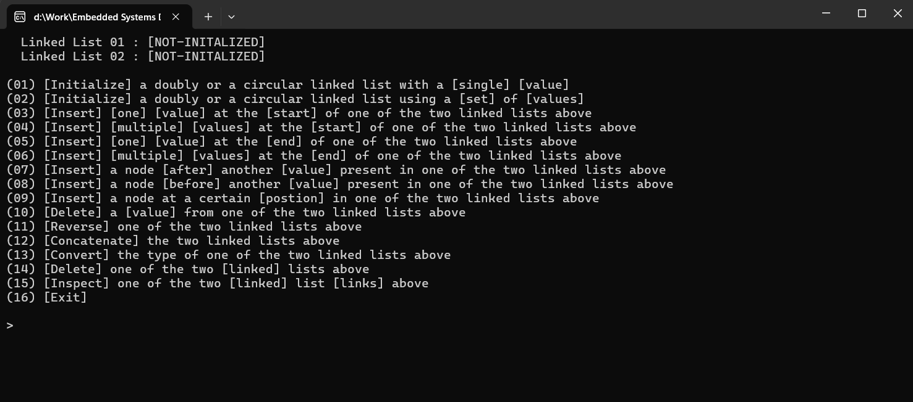

# Multi Linked List Manager (C Project)

This project is a **command-line interface (CLI) tool** written in C that allows users to **create, manage, and manipulate multiple linked lists simultaneously**.  
It combines **doubly linked list** and **circular list** capabilities into a single, configurable system, built with modular design and strong focus on pointer-based logic.

---

## ⚙️ Core Features

### Multi-List Management
- You can **define multiple lists** in the configuration section.
- Switch between them easily during runtime.
- Each list maintains its own independent data, nodes, and structure.

### List Operations
- Insert at beginning / end / after / before specific nodes.
- Delete nodes (by value, from head, or from tail).
- Reverse the list.
- Convert to circular mode or back to linear.
- Concatenate two lists.
- Count or search for specific elements.
- Inspect list links.

### Configuration System
- Simple configuration structure allows declaring multiple linked lists upfront.
- Lists can be **doubly linked** or **circular doubly linked** depending on your setup.
- Each operation can be applied to any configured list using CLI options.

### Command-Line Interface (CLI)
- Interactive text-based menu in the terminal (CMD).
- You can select which list to work on.
- Choose an operation (insert, delete, print, reverse, etc.).
- See results immediately.

### Technical Highlights
- Built entirely in **C**, using **dynamic memory allocation** (`malloc`, `free`).
- Modular design with reusable functions for:
  - Node creation and linking.
  - Traversal and display.
  - List configuration and selection.
- Supports **bi-directional traversal** via `prev` and `next` pointers.
- Optional **circular linkage** for continuous traversal.
- Memory-safe approach, every allocation and free handled carefully.

