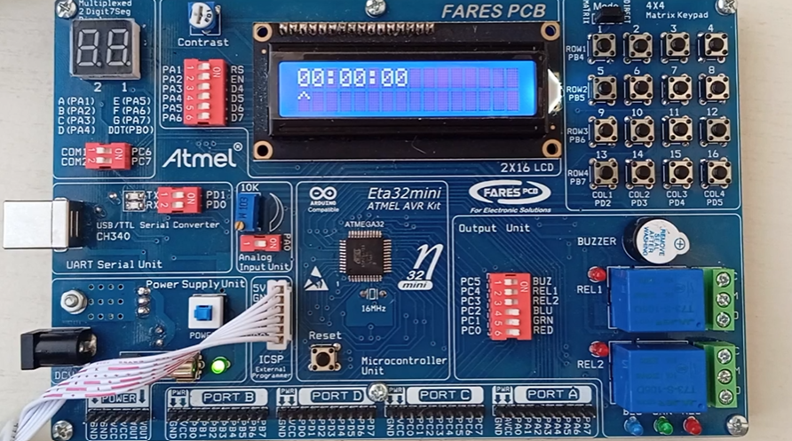

# AVR Countdown Timer Project

This project implements a **countdown timer** on an **AVR microcontroller** using a **16x2 LCD**, **4x4 Keypad**, and a **LED alert**.  
The timer allows users to **set hours, minutes, and seconds** directly from the keypad, and displays a live countdown on the LCD until time reaches zero.  

---

## ⚙️ Features

- Fully interactive **time setup** using keypad  
  - Set hours, minutes, and seconds independently  
  - Navigate between digits using `<` and `>` keys  
- **Real-time countdown** display in the format `HH:MM:SS`
- **LED blinking** on countdown completion
- Uses **CGRAM custom character** for animation on the LCD  
- Responsive input handling with clean UI on a single 16x2 LCD  
- Optimized **time-to-seconds conversion** for accurate countdown logic

---

## 🎮 Controls

| Key | Function |
|-----|-----------|
| `0–9` | Set the selected digit |
| `<` | Move cursor left |
| `>` | Move cursor right |
| `S` | Start countdown |

---

## ⚠️ Limitations

- Maximum supported input: `99:99:99` (due to 2-digit fields)
- Does **not** support pausing or resuming the countdown once started  
- No EEPROM saving (time resets after restart)  

